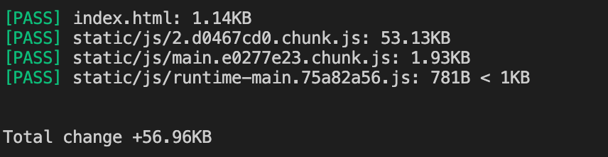
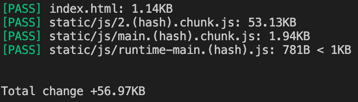
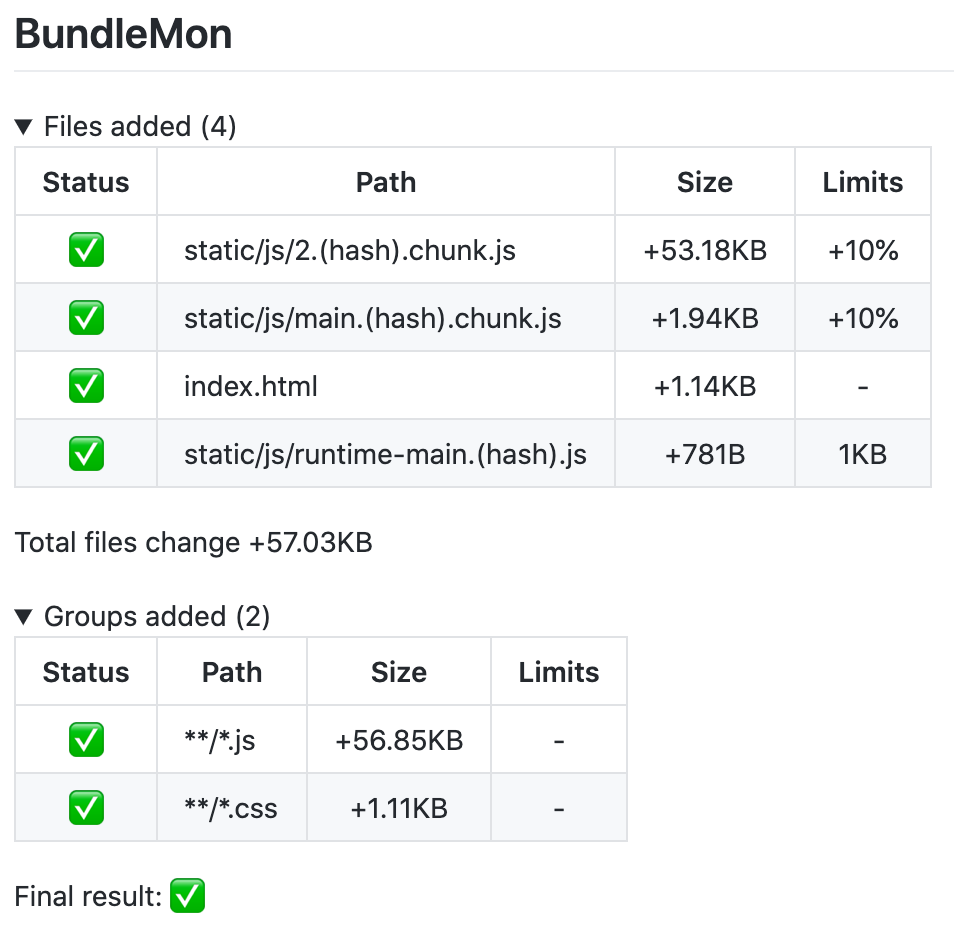
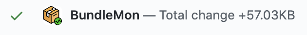

This step by step guide will help you set up [BundleMon](https://github.com/LironEr/bundlemon) with GitHub action

### Clone repo

For this guide I used this repo: https://github.com/Yog9/SnapShot

```
git clone https://github.com/Yog9/SnapShot
```

### Build

```
yarn build
```

### Add BundleMon

```
yarn add -D bundlemon
```

### Add BundleMon config

Create a file new file `.bundlemonrc.json`

```json
{
  "baseDir": "./build",
  "files": [
    {
      "path": "index.html"
    },
    {
      "path": "static/js/*.chunk.js",
      "maxPercentIncrease": 10
    },
    {
      "path": "static/js/runtime-main.*.js",
      "maxSize": "1kb"
    }
  ]
}
```

### Run BundleMon

```
yarn bundlemon
```



### Ignore hash in file name

Changing app code will cause webpack to generate a new hash for files that have been changed.

```
main.e0277e23.chunk.js -> main.c2a935b4.chunk.js
```

In order for BundleMon to know it's the same file you need to add `<hash>` string to file path config:

```json
{
  "baseDir": "./build",
  "files": [
    {
      "path": "index.html"
    },
    {
      "path": "static/js/*.<hash>.chunk.js",
      "maxPercentIncrease": 10
    },
    {
      "path": "static/js/runtime-main.<hash>.js",
      "maxSize": "1kb"
    }
  ]
}
```



### Create BundleMon project

In order to save history and get differences from your main branches you will need to create a new project and setup environment variables.

- [Create new project](https://app.bundlemon.dev/create-project) and copy the project ID and API key
- Add `BUNDLEMON_PROJECT_ID` to pipeline variables
- Add `BUNDLEMON_PROJECT_APIKEY` to pipeline variables - **not required for public repos**

> API key is a secret, see how to [create encrypted secrets in GitHub](https://docs.github.com/en/free-pro-team@latest/actions/reference/encrypted-secrets#creating-encrypted-secrets-for-a-repository)

### GitHub action

Create a new file `.github/workflows/build.yml`

```yaml
name: Build

on:
  push:
    branches: [main]
  pull_request:
    types: [synchronize, opened, reopened]

jobs:
  build:
    runs-on: ubuntu-latest
    steps:
      - uses: actions/checkout@v2
      - name: Use Node.js 12
        uses: actions/setup-node@v2-beta
        with:
          node-version: "12"

      - name: Install dependencies
        run: yarn

      - name: Build
        run: yarn build

      # https://frontside.com/blog/2020-05-26-github-actions-pull_request/#how-does-pull_request-affect-actionscheckout
      - name: override CI_COMMIT_SHA
        if: github.event_name == 'pull_request'
        run: echo "CI_COMMIT_SHA=${{ github.event.pull_request.head.sha}}" >> $GITHUB_ENV

      - name: Run BundleMon
        run: yarn bundlemon
        env:
          BUNDLEMON_PROJECT_ID: YOUR_PROJECT_ID
          BUNDLEMON_PROJECT_APIKEY: ${{ secrets.BUNDLEMON_PROJECT_APIKEY }} # not required for public repos
```

> Make sure you have `override CI_COMMIT_SHA` step before `BundleMon` step, more info can be found [here](https://frontside.com/blog/2020-05-26-github-actions-pull_request/#how-does-pull_request-affect-actionscheckout)

### Add GitHub integration

[Install BundleMon GitHub App](https://github.com/apps/bundlemon) and add output configuration to BundleMon config

```json
"reportOutput": ["github"]

// or override default options

"reportOutput": [
  [
    "github",
    {
      "checkRun": false,
      "commitStatus": true,
      "prComment": true
    }
  ]
]
```

When creating your [first PR](https://github.com/LironEr/bundlemon-github-actions/pull/1) with BundleMon you should see all files found by BundleMon as "Added", because there isn't a record on your main branch.


<br />


Once you merge the PR BundleMon will keep a record on your main branch, so on your next PR you should see the difference between the PR and your main branch.
